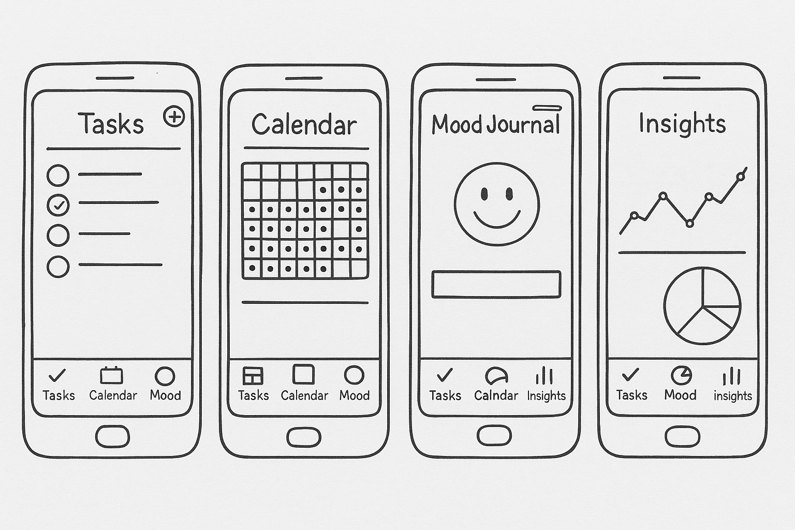

# LifeSync

## Table of Contents
1. [Overview](#overview)  
2. [Product Spec](#product-spec)  
3. [Wireframes](#wireframes)  
4. [Schema](#schema)  

---

## Overview

### Description
**LifeSync** is an all-in-one iOS productivity and wellness app that combines task management, calendar scheduling, mood journaling, and insights. It helps users track their tasks and emotional well-being over time, offering meaningful insights into productivity and mood patterns.

### App Evaluation
- **Category:** Productivity / Wellness  
- **Mobile:** Exclusively iOS with tab navigation using SwiftUI  
- **Story:** Helps users improve task planning while keeping track of emotional wellness through mood journaling and analytics  
- **Market:** Targeted at students, professionals, and anyone interested in balanced productivity and mental health  
- **Habit:** Designed to be used daily for to-do tracking and mood logging  
- **Scope:** Four main modules — Tasks, Calendar, Mood Journal, and Insights — with future scope for cloud sync and notifications  

---

## Product Spec

### 1. User Stories (Required and Optional)

**Required Must-have Stories**
- [x] User can add tasks  
- [x] User can edit tasks  
- [x] User can delete tasks  
- [x] User can view a calendar and see tasks by date  
- [ ] User can log daily mood using emojis or sliders  
- [ ] User can write a short note about mood  
- [ ] User can view mood trends over week, month, or year  
- [ ] Local data persistence for tasks and mood entries  

**Optional Nice-to-have Stories**
- [ ] User can receive daily reminders to log mood  
- [ ] User can filter tasks by mood or priority  
- [ ] Insights screen can show task-mood correlation  
- [ ] Dark mode toggle  
- [ ] Streak tracker for habits or mood  

---

### 2. Screen Archetypes

- **Tasks Screen**
  - Add/edit/delete tasks  
  - Mark tasks as complete  
  - Display list of tasks  

- **Calendar Screen**
  - View monthly calendar  
  - Select date to view tasks  
  - Tap date → view/edit task list  

- **Mood Journal Screen**
  - Choose daily mood (emoji/slider)  
  - Enter optional text note  
  - Save mood entry for the day  

- **Insights Screen**
  - View graphs of mood over time  
  - Select range: daily/weekly/monthly/yearly  
  - See common moods and streaks  

---

### 3. Navigation

**Tab Navigation** (Tab to Screen)  
- 📝 Tasks → Task List Screen  
- 📅 Calendar → Monthly Calendar View  
- 😊 Mood → Mood Journal Entry  
- 📊 Insights → Mood Analytics & Graphs  

**Flow Navigation** (Screen to Screen)  
- **Tasks Screen**
  - Tap task → Edit Task View  
- **Calendar Screen**
  - Tap date → Task List for selected date  
- **Mood Screen**
  - Log mood → Save and return to summary  
- **Insights Screen**
  - Select range → Update graph dynamically  

---

## Wireframes

---

## Schema 

> This section will be completed in Unit 9.

### Models

#### Task
| Property | Type   | Description            |
|----------|--------|------------------------|
| id       | UUID   | Unique task identifier |
| title    | String | Task name              |
| dueDate  | Date   | Date assigned          |
| isDone   | Bool   | Completion status      |

#### MoodEntry
| Property  | Type   | Description               |
|-----------|--------|---------------------------|
| id        | UUID   | Unique entry ID           |
| moodLevel | Int    | Numeric or enum value     |
| note      | String | Optional mood explanation |
| date      | Date   | Entry date                |

----

## Video Walkthrough

Loom link to project demo - https://www.loom.com/share/e48581d4ae6149a7a0e1a8072bbd6a4e?sid=3d0127ec-8080-49ab-94ab-9b085f130549 

---

### Networking
- [X] Not currently using external APIs  
- [X] All data handled locally with CoreData
